# Lab Report 4
## This lab report will contain two parts:
* Edit lab7, `commit`, and `push` it on on `ieng6 account` based on `https://github.com/Jessyjy7/lab7.git`
* Edit lab7, `commit`, and `push` it on on `ieng6 account` based on `git@github.com:Jessyjy7/lab7.git`

## Part 1: Edit lab7 based on `https`
step 1-3 are the preparations to clean and recreate the fork

Step 4: Log into ieng6
* For this step, I typed `ssh cs15lsp23qt@ieng6.ucsd.edu<enter>` in the terminal and since I have the key stored, the terminal led me directly to the ieng6 account.
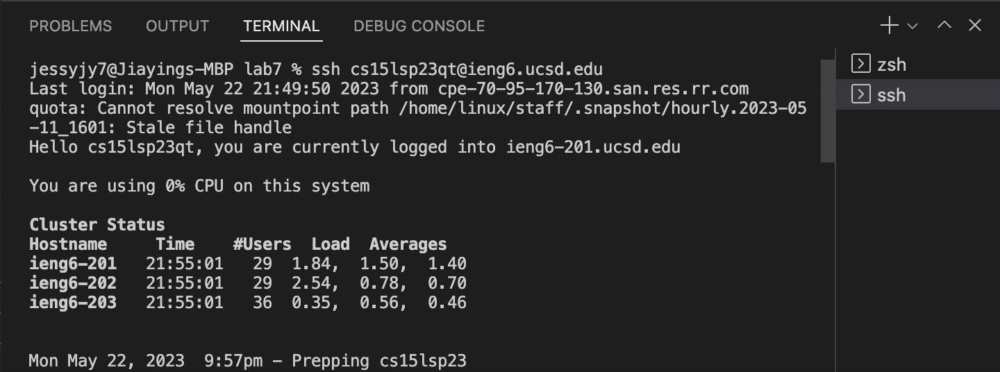

Step 5: Clone your fork of the repository from your Github account
* For this step, I typed `git clone https://github.com/Jessyjy7/lab7.git<enter>` and the account will have a directory called `lab7` and clone the code into it.
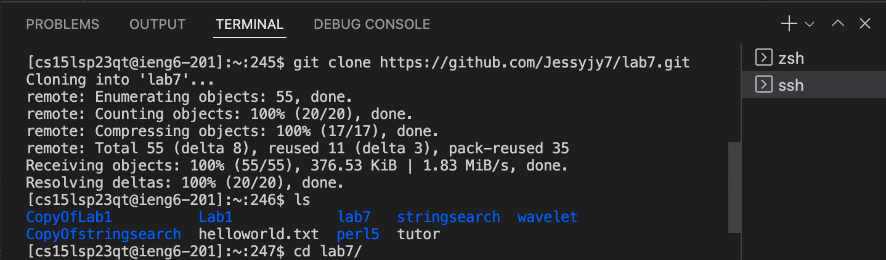

Step 6: Run the tests, demonstrating that they fail
* For this step, I typed `ls<enter>` then `cd lab7<enter>` to get into `lab7` directory and typed `bash test.sh<enter>` to run the tests, and the result is `Tests run: 2,  Failures: 1`
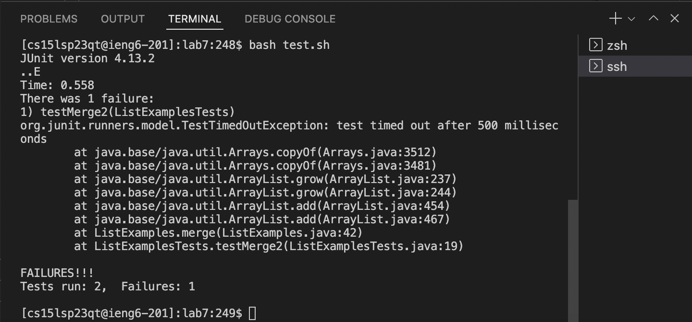

Step 7: Edit the code file ListExamples.java to fix the failing test (as a reminder, the error in the code is just that index1 is used instead of index2 in the final loop in merge)
* For this step, I first typed `vim ListExamples.java` to get into vim mode, then I pressed `<down><down><down><down><down><down><down><down><down><down><down><down><down><down><down><down><down><down><down><down><down><down><down><down><down><down><down><down><down><down><down><down><down><down><down><down><down><down><down><down><down><down><down><right><right><right><right><right><right><right><right><right><right><right><right><i><delete><2><esc>`to change the curser to the spot I need to change `index1` to `index2` useing `<i>` and `<delete>` then `<esc>` from editing mode.
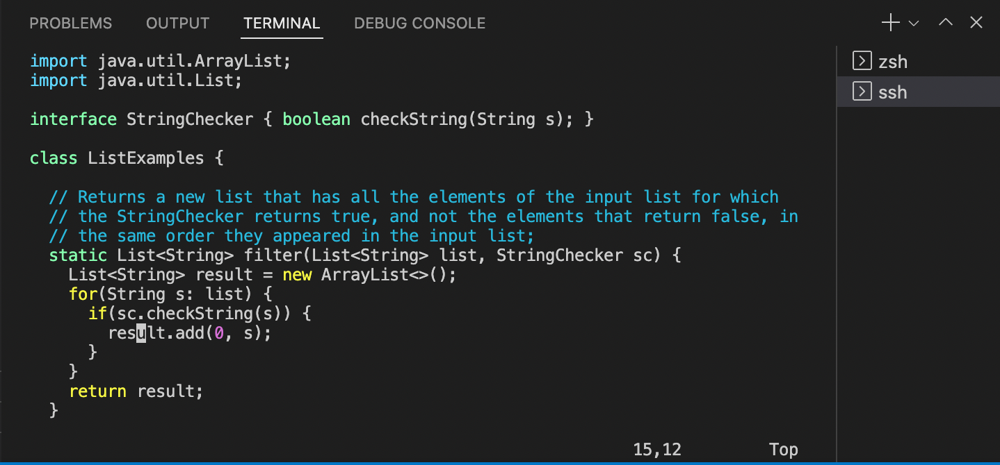
* Then I typed `:wq<enter>` to save the file and quit the `vim` mode.
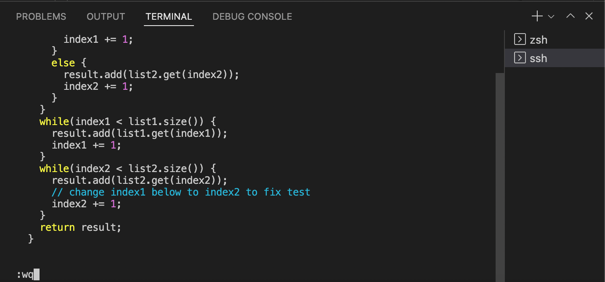

Step 8: Run the tests, demonstrating that they now succeed
* For this step, I typed `bash test.sh` again and saw the all the tests passed.
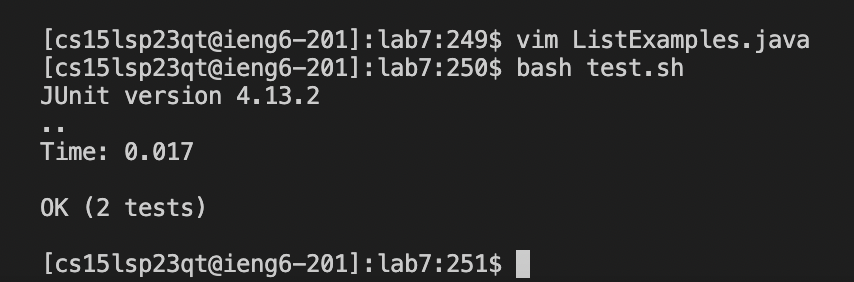

Step 9: Commit and push the resulting change to your Github account
* For this step, I typed `git add ListExmaples.java`, `git commit -m "change the last index1 to index2"` to commit the change I made.
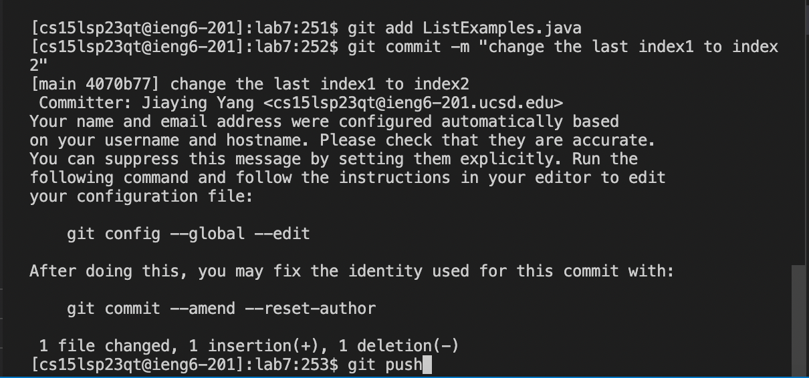
* Then I typed `git push` to push the changes to `Github`
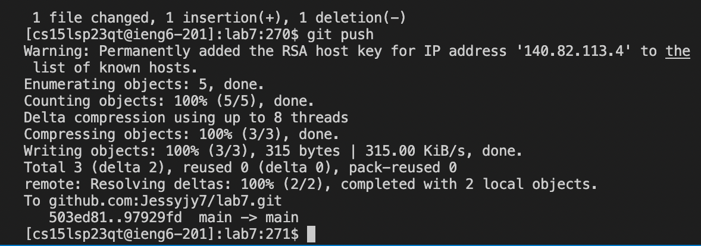
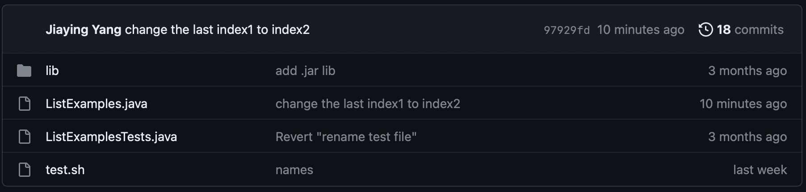

*At the end of part two I used `rm -r lab7` to delete the directory on the ieng6 account and deleted the fork I created this time on `Github`.

## Part 1: Edit lab7 based on `SSH`
step 1-3 are the preparations to clean and recreate the fork

Step 4: Log into ieng6
* For this step, I typed `ssh cs15lsp23qt@ieng6.ucsd.edu<enter>` in the terminal and since I have the key stored, the terminal led me directly to the ieng6 account.
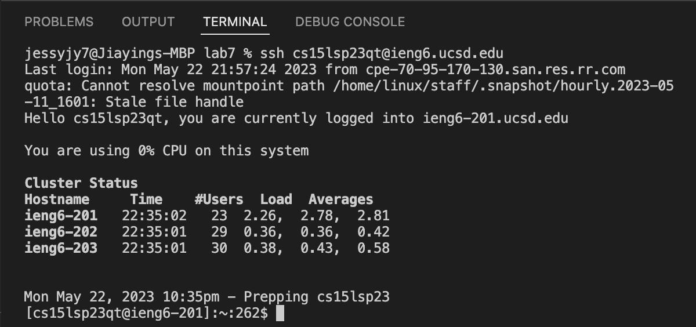

Step 5: Clone your fork of the repository from your Github account
* For this step, I typed `git clone git@github.com:Jessyjy7/lab7.git<enter>` and the account will have a directory called `lab7` and clone the code into it.
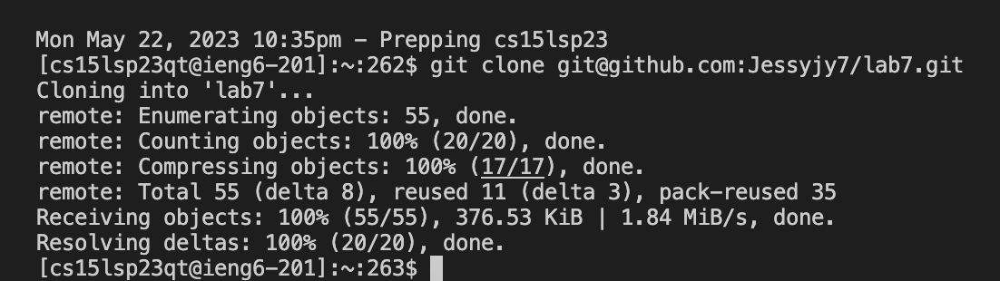

Step 6: Run the tests, demonstrating that they fail
* For this step, I typed `ls<enter>` then `cd lab7<enter>` to get into `lab7` directory and typed `bash test.sh<enter>` to run the tests, and the result is `Tests run: 2,  Failures: 1`
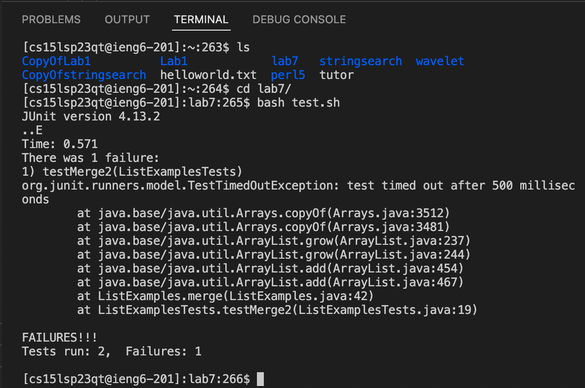

Step 7: Edit the code file ListExamples.java to fix the failing test (as a reminder, the error in the code is just that index1 is used instead of index2 in the final loop in merge)
* For this step, I first typed `vim ListExamples.java` to get into vim mode, then I pressed `<down><down><down><down><down><down><down><down><down><down><down><down><down><down><down><down><down><down><down><down><down><down><down><down><down><down><down><down><down><down><down><down><down><down><down><down><down><down><down><down><down><down><down><right><right><right><right><right><right><right><right><right><right><right><right><i><delete><2><esc>`to change the curser to the spot I need to change `index1` to `index2` useing `<i>` and `<delete>` then `<esc>` from editing mode.
* Then I typed `:wq<enter>` to save the file and quit the `vim` mode.
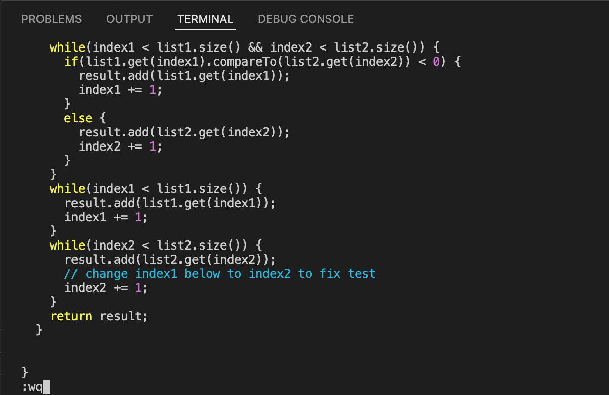

Step 8: Run the tests, demonstrating that they now succeed
* For this step, I typed `bash test.sh` again and saw the all the tests passed.
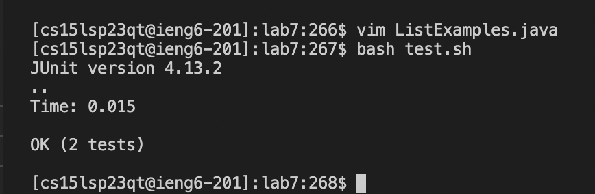

Step 9: Commit and push the resulting change to your Github account
* For this step, I typed `git add ListExmaples.java`, `git commit -m "change the last index1 to index2"` to commit the change I made.
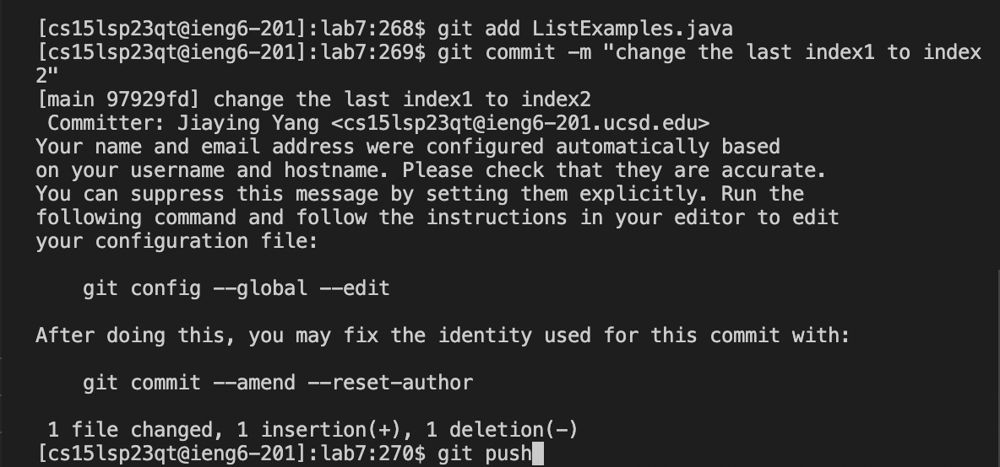
* Then I typed `git push` to push the changes to `Github`

* Then the changes could be pushed to `Github`, all the tasks finisehd for this lab.

